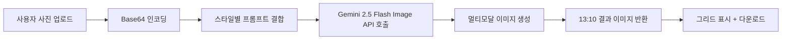

# 🎨 AI 그림체 변신 스튜디오

> **내 사진을 6가지 인기 그림체 캐릭터로 변신!**
> Google Gemini 2.5 Flash Image(나노 바나나)를 활용한 웹 기반 AI 이미지 변환 스튜디오입니다.
> 학교 행사·체험 부스에서 즉석 인화하여 배부할 수 있도록 **13:10 인쇄 비율**로 결과물을 생성합니다.

[](https://ai-style-transfer-1310-studio.vercel.app/)
[](https://ai.google.dev/gemini-api/docs/image-generation)
[](https://aistudio.google.com/apikey)

---

## ✨ 주요 기능

| 기능 | 설명 |
|------|------|
| 🖼️ **6가지 그림체** | 지브리 · 짱구는 못말려 · 마블 코믹스 · 디즈니/픽사 · 80년대 레트로 애니 · 웹툰 주인공 |
| ☑️ **다중 스타일 동시 선택** | 한 사진으로 여러 스타일을 한 번에 변환 |
| 🎚️ **스타일별 생성 개수 조절** | 1~3장까지 슬라이더로 조정 (총 최대 18장) |
| 📐 **13:10 인쇄 비율** | 학교/행사 부스 인화에 최적화된 가로형 출력 |
| 🔍 **결과 이미지 확대 보기** | 모달 뷰어로 디테일 확인 |
| 💾 **개별/전체 다운로드** | 하나씩 저장 또는 ZIP 일괄 다운로드 |
| 🔐 **BYOK 방식** | 사용자 본인의 Gemini API 키 사용 (키는 외부 저장 안 함) |
| 🌙 **다크 테마 UI** | Pretendard + 명조체 조합의 차분한 디자인 |

---

## 🚀 바로 사용하기

👉 **[https://ai-style-transfer-1310-studio.vercel.app/](https://ai-style-transfer-1310-studio.vercel.app/)**

### 사용 단계
1. **사진 업로드** - 얼굴이 잘 보이는 선명한 사진 한 장 선택
2. **API 키 입력** - [Google AI Studio](https://aistudio.google.com/apikey)에서 무료 발급
3. **그림체 선택** - 원하는 스타일 체크 (복수 선택 가능)
4. **생성 개수 조절** - 스타일당 1~3장
5. **"그림체 변신 시작!"** 클릭 → 잠시 대기
6. **결과 저장** - 개별 다운로드 또는 ZIP 일괄 다운로드

> ⚠️ AI가 얼굴 특징을 항상 완벽히 반영하진 못합니다. 마음에 드는 결과를 위해 몇 번 시도해 보세요.

---

## 🛠️ 기술 스택

| 분류 | 기술 |
|------|------|
| **프론트엔드** | Vanilla JavaScript (단일 `index.html` 파일) |
| **스타일링** | Tailwind CSS (CDN) |
| **타이포그래피** | Pretendard, Nanum Myeongjo |
| **AI 모델** | Google **Gemini 2.5 Flash Image** (`gemini-2.5-flash-image`) |
| **압축 다운로드** | [JSZip](https://stuk.github.io/jszip/) 3.10.1 |
| **호스팅** | Vercel (정적 웹사이트, GitHub 연동 자동 배포) |

> 💡 빌드 도구·서버·프레임워크 없음 — `index.html` 한 파일이 전부입니다.

---

## 📦 로컬 실행

```bash
# 저장소 복제
git clone https://github.com/tigerjk9/AI-style-transfer-studio-1310.git
cd AI-style-transfer-studio-1310

# 간단한 정적 서버 실행 (Python 3 기준)
python -m http.server 8000

# 브라우저에서 접속
# http://localhost:8000
```

> 💡 별도 빌드 과정이 필요 없으며, `index.html`을 브라우저에서 직접 열어도 동작합니다.

---

## 🔑 API 키 발급 가이드

1. [Google AI Studio](https://aistudio.google.com/apikey) 접속
2. Google 계정으로 로그인
3. **"Create API Key"** 클릭 → 키 복사
4. 본 앱 입력란에 붙여넣기

> 🔒 **보안:** API 키는 사용자 브라우저 내에서만 사용되며, 별도 서버나 외부로 전송·저장되지 않습니다.
> 단, 입력 필드에 잠시 보관되므로 **공용 PC 사용 후에는 새로고침** 권장합니다.

---

## 🎨 지원 스타일 상세

각 스타일은 정교하게 다듬어진 프롬프트로 작동하며, 모든 결과물은 **13:10 가로형 고해상도**로 출력됩니다.

| # | 스타일 | 특징 |
|---|--------|------|
| 1 | ✨ **지브리 스타일** | 회화풍, 부드러운 조명, 손그림 감성 |
| 2 | 😂 **짱구는 못말려 스타일** | 굵은 외곽선, 단순한 얼굴, 플랫 컬러링 |
| 3 | 🦸‍♂️ **마블 코믹스 스타일** | 강한 라인아트, 셀 셰이딩, 다이내믹 |
| 4 | 👑 **디즈니/픽사 스타일** | 3D 렌더링, 큰 눈, 부드러운 입체 조명 |
| 5 | 📺 **80년대 레트로 애니** | 빈티지 컬러, 샤프한 헤어 하이라이트 |
| 6 | 🎨 **웹툰 주인공 스타일** | 한국 웹툰 특유의 깔끔한 디지털 라인 |

---

## 🧠 작동 원리



핵심은 **프롬프트 엔지니어링**입니다. 단순히 "지브리 스타일로"가 아니라, 각 스타일의 미묘한 특징(라인 굵기, 색감, 표정, 배경 등)을 모델이 정확히 이해하도록 영문 프롬프트를 정교하게 설계했습니다.

또한 모든 프롬프트 끝에는 다음 인쇄용 사양을 강제합니다:

> *Final Output Specification: Generate a high-resolution horizontal image with a strict 13:10 aspect ratio, suitable for printing.*

---

## 📁 저장소 구성

```
AI-style-transfer-studio-1310/
├── README.md       # 본 문서
└── index.html      # 단일 파일 웹앱 (HTML + CSS + JS 통합)
```

---

## 🎯 활용 사례

- 🎓 **학교 행사·체험 부스** - AI 캐릭터 즉석 인화 코너
- 📸 **AI 증명사진 워크숍** - 변형 응용 사례
- 🎁 **개인 프로필/SNS 이미지** - 새로운 모습으로 변신
- 🧑‍🏫 **AI·프롬프트 교육 데모** - 멀티모달 모델 시연

---

## 🐛 알려진 제약

- 얼굴 인식이 어려운 사진(측면, 가림, 저해상도)은 결과 품질 저하
- 모델 응답 시간: 스타일·개수에 따라 수 초~수십 초 소요
- API 무료 할당량을 초과하면 429 오류 발생 (자동 재시도 3회 포함)
- 모바일에서 동작은 하나 PC 환경 권장

---

## 🌟 향후 개선 아이디어

- [ ] 사진 업로드 전 얼굴 자동 검출 + 크롭 가이드
- [ ] 결과 이미지 일괄 인쇄 미리보기 (A4 4컷 레이아웃)
- [ ] 사용자 정의 프롬프트/스타일 추가 기능
- [ ] 다국어 지원 (영어/일본어)
- [ ] PWA 변환으로 오프라인 진입 지원

---

## 🙏 크레딧

- **Google Gemini 2.5 Flash Image (Nano Banana)** - 멀티모달 이미지 생성 모델
- **Tailwind CSS** - 유틸리티 우선 CSS 프레임워크
- **JSZip** - 클라이언트 사이드 ZIP 생성
- **Pretendard** - by [@orioncactus](https://github.com/orioncactus/pretendard)
- **나노 바나나 프롬프트 참고** - [tigerjk9.github.io/ai/nano-banana](https://tigerjk9.github.io/ai/nano-banana/)

---

## 📝 라이선스

MIT License - 자유롭게 사용·수정·재배포 가능합니다.

---

## 👤 제작자

**김진관 (닷커넥터)**
> *배움, 나눔, 성장을 추구하는 연결주의자*

- GitHub: [@tigerjk9](https://github.com/tigerjk9)
- 블로그: [tigerjk9.github.io](https://tigerjk9.github.io/)
- Project Link: [AI-style-transfer-studio-1310](https://github.com/tigerjk9/AI-style-transfer-studio-1310)

---

> 🎨 **지금 바로 [AI 그림체 변신 스튜디오](https://ai-style-transfer-1310-studio.vercel.app/)에서 세상에 단 하나뿐인 당신의 캐릭터를 만나보세요!**
